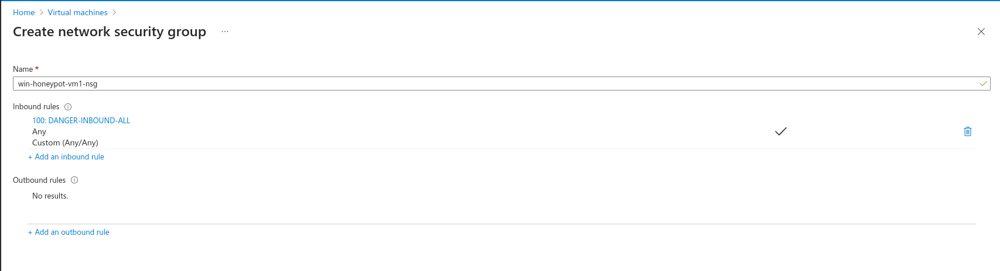
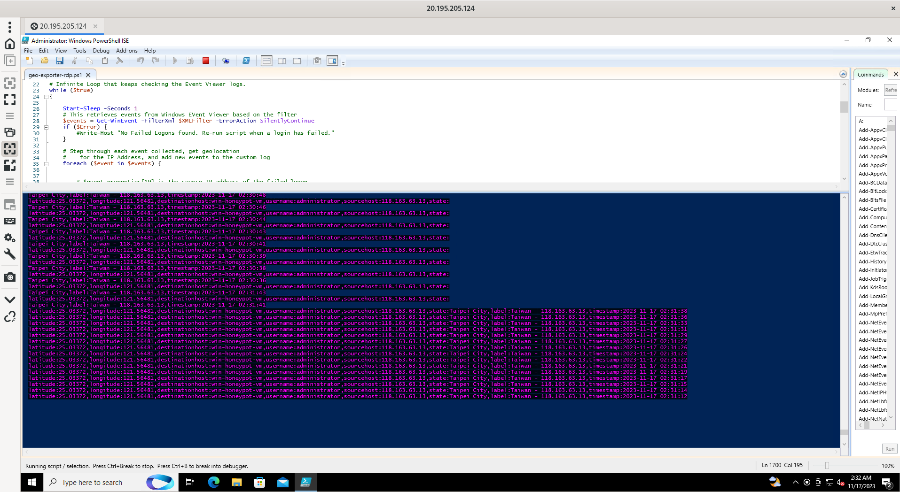
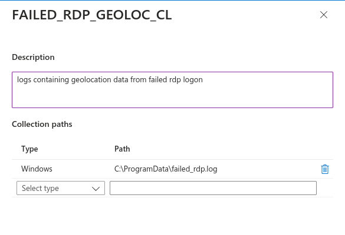
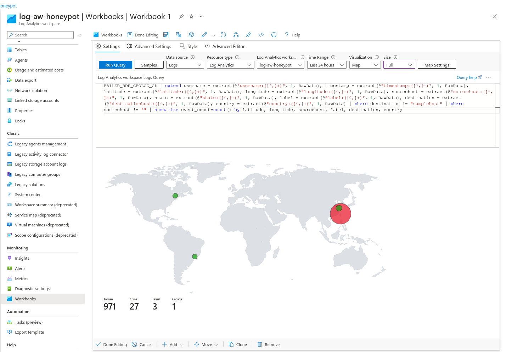
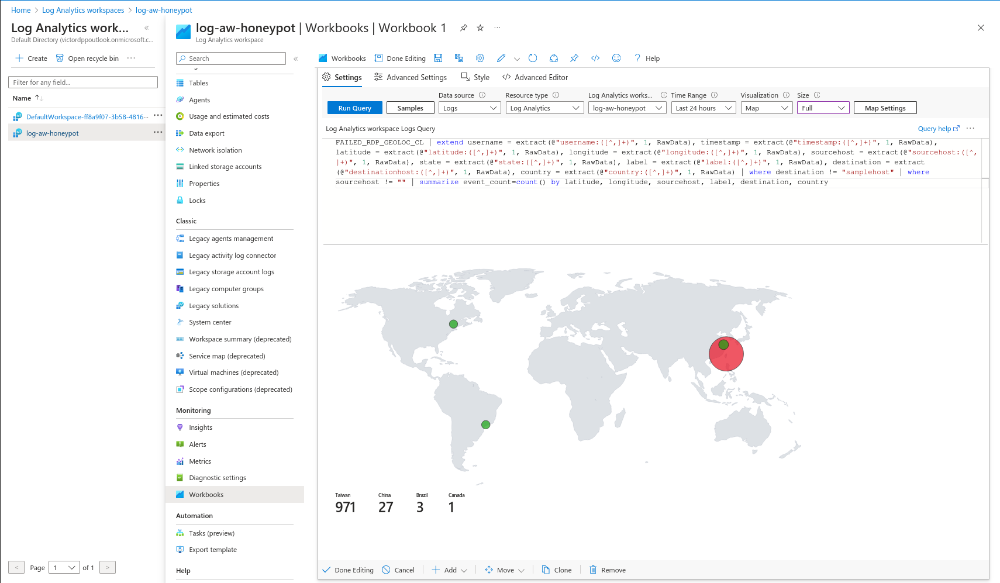

# Azure Cloud SIEM - RDP Bruteforce Honeypot

## Introduction
This project is a simple Honeypot made in Microsoft Azure with the objective of learning about the cloud SIEM platform as I used custom logs and a world-map view of the data to analyse live RDP Bruteforce attacks to a vulnerable VM.

## Microsoft Components Used
- Microsoft Defender for Cloud (New Azure Sentinel)
- Virtual Machines
- Log Analytics Workspace 
- Custom Logs
- Workbooks
- Powershell

## About the Honeypot
The Virtual Machine was setup with all of its inbound rules in Azure open, while also disabling Windows Defender Firewall. For the purposes of the lab, the VM needed to be discoverable from anywhere for a better data collection.

## About the Logs

By gathering the attackers IP from the Windows Event Viewer - Event 4625 (Failed Logon), I was able to use a Powershell script to look up an API that retrieves the geolocation of the IP, and log it into a custom log file, that was later fed into the Azure Log Analytics Workspace

## Data Retrieved

|Request Amount|Requests Per Minute before 10 PM|Requests Per Minute after 10 PM|Estimated Total Time|
|:-:|:-:|:-:|:-:|
|1000|0.03|11.056|7h|

> the API's free plan has a 1000 request per day limit.

## Final Result

> Taiwan really wanted to get into the VM lol

## Conclusions
This project really helped me to consolidate my knowledge about SIEM solutions, the Microsoft Azure platform, Log Analysis, Powershell scripting, and get an overall idea of the process of setting up an Cloud SIEM.