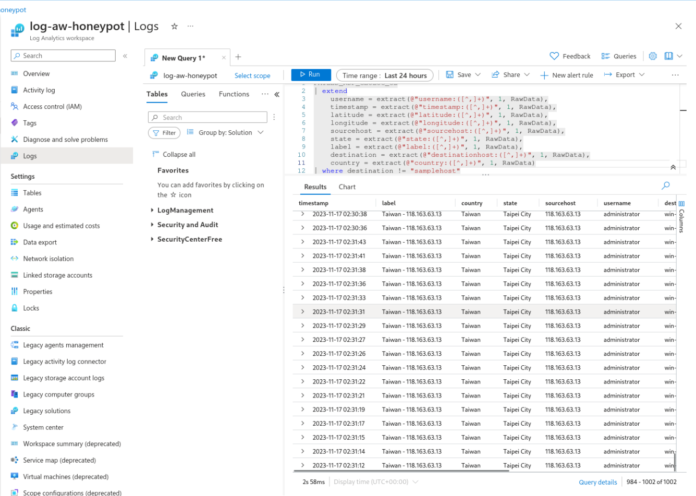

# Azure Cloud SIEM - RDP Bruteforce Honeypot

## Introduction

This project is a simple Honeypot made in Microsoft Azure with the objective of learning about the cloud SIEM platform as I used custom logs and a world-map view of the data to analyse live RDP Bruteforce attacks to a vulnerable VM.

## Microsoft Components Used

- Microsoft Defender for Cloud (New Azure Sentinel)
- Virtual Machines
- Log Analytics Workspace 
- Custom Logs
- Workbooks
- Powershell

## About the Honeypot

The Virtual Machine's Network Security Group was configured with all of its inbound rules open, while also disabling Windows Defender Firewall inside the VM. For the purposes of the lab, the VM needed to be discoverable from anywhere for a better data collection, so this was an necessary step.

> As the image above shows, I created an inbound rule described as DANGER-INBOUND-ALL, with a priority of 100.

## About the Logs

By gathering the attackers IP from the Windows Event Viewer - Event 4625 (Failed Logon), I was able to use a Powershell script to send the attackers IP to an API that retrieves the geolocation of the IP, and document it into a custom log file, that was later fed into the Azure Log Analytics Workspace for the analysis.

> The image above shows the powershell script running, displaying all of the failed connections made by the attackers with their respective Latitude, Longitude, State, City, Destination Host, Username, IP, and the Timestamp.

> Here we have the configuration/setup of the connection of the custom RDP log inside the VM with the Log Analytics Workspace. This will allow us to search for the contents of the log as a Query inside the platform, extracting the data however we want depending on the query.

> The custom query created to retrieve the correct data separated into columns is shown in this image.

## Data Retrieved

|Request Amount|Requests Per Minute before 10 PM|Requests Per Minute after 10 PM|Estimated Total Time|
|:-:|:-:|:-:|:-:|
|1000|0.03|11.056|7h|

> the API's free plan has a 1000 request per day limit.

The data clearly displays the timeframe preferred by the attackers, be them automated or manual. Computer systems tend to be more targeted after commercial hours, where most people would not be paying close attention to their systems.

## Final Result

By configuring a custom workbook to gather the data from the Failed RDP Logins, choosing Azure's Map Visualization format, and setting up the Latitude and Longitude options to match the ones from the logs, I was able to visually display the information in a easily digestible and practical way.

> Taiwan really wanted to get into the VM hahaha

## Conclusions
This project was fundamental to consolidate my knowledge about SIEM solutions, the Microsoft Azure platform, Log Analysis, Powershell scripting, and to get an overall experience on the process of setting up an Cloud SIEM and acting as a SOC Analyst.
